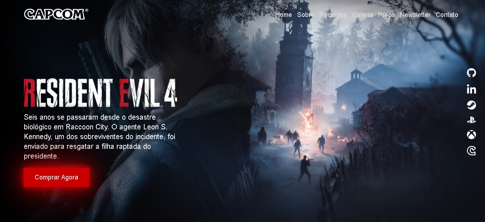
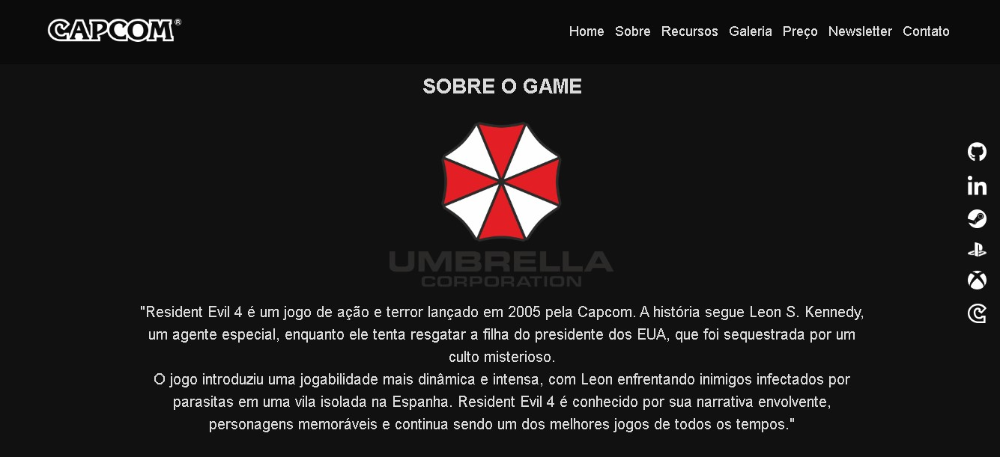
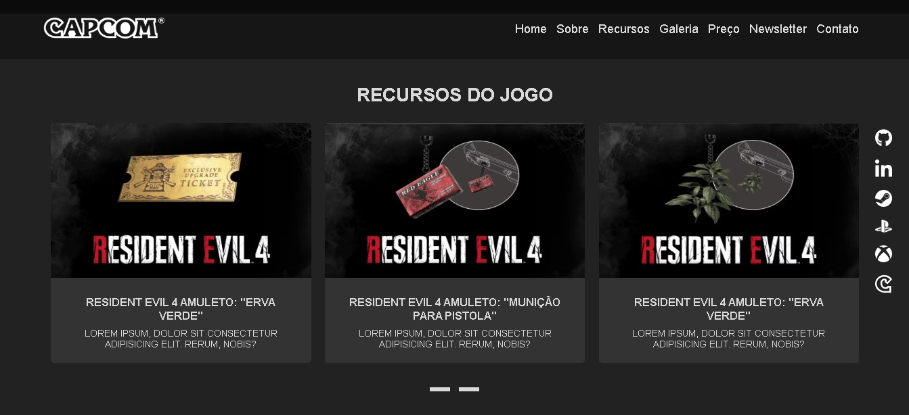
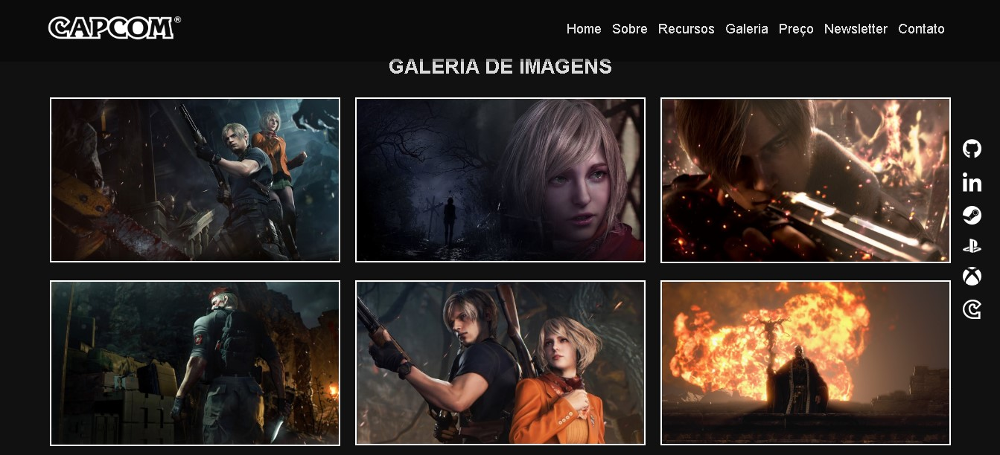
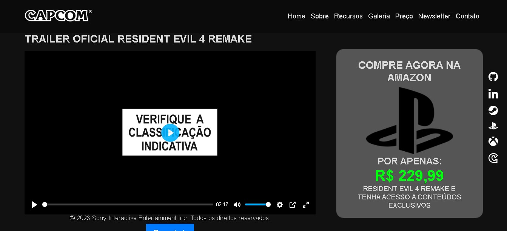
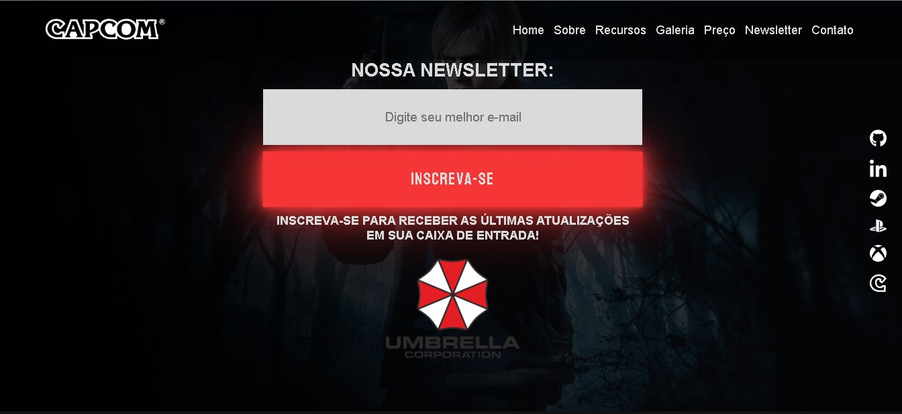
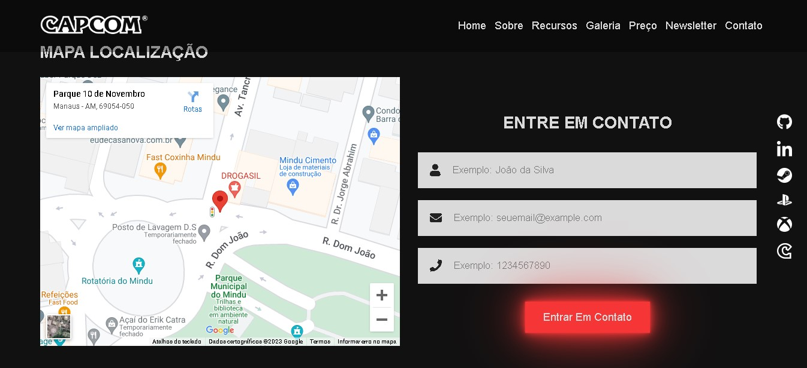
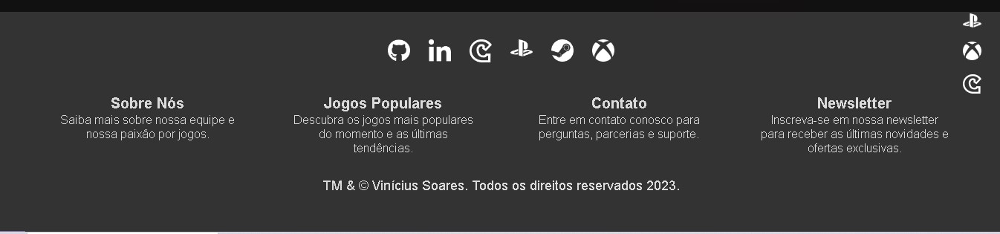

# Projeto Resident Evil 4 Remake

Bem-vindo ao projeto Resident Evil 4 Remake! Este é um site fictício criado para promover o jogo Resident Evil 4 Remake. Este documento fornece uma visão geral do projeto, incluindo informações sobre as tecnologias utilizadas, seções do site e seu conteúdo.

## Print do projeto

## Visão Geral do Projeto

O Resident Evil 4 Remake é um site fictício projetado para promover o jogo "Resident Evil 4 Remake". Ele oferece informações sobre o jogo, imagens, trailers, recursos, uma galeria de imagens e um formulário de inscrição na newsletter.

## Tecnologias Utilizadas

O projeto faz uso de várias tecnologias para criar uma experiência interativa. Algumas das principais tecnologias incluem:

- **HTML/CSS**: A estrutura do site e a estilização são construídas em HTML e CSS.

- **JavaScript**: JavaScript é usado para adicionar interatividade ao site, incluindo funcionalidades como carrosséis, modais e reprodução de vídeos.

- **Plyr**: A biblioteca Plyr é usada para personalização do player de vídeo.

- **Font Awesome**: Fornece ícones para a interface do usuário.

- **Fancybox**: Biblioteca usada para criar uma galeria de imagens com recursos de lightbox.

- **Owl Carousel**: Usado para criar carrosséis interativos de imagens e conteúdo.

- **Google Fonts**: Fonts personalizados são carregados a partir do Google Fonts.

## Seções do Site

O site é dividido em várias seções, cada uma com seu próprio conteúdo:

1. **Home**: Apresenta um carrossel de imagens e informações sobre o jogo. Você pode comprar pelo botão "Comprar Agora".

2. **Sobre o Jogo**: Uma seção que descreve o enredo e os destaques do jogo Resident Evil 4 Remake.

3. **Recursos do Jogo**: Destaca os principais recursos do jogo, incluindo itens e armas especiais.

4. **Galeria de Imagens**: Uma coleção de imagens do jogo em formato de galeria.

5. **Trailer Oficial**: Apresenta o trailer oficial do jogo.

6. **Preço**: Fornece informações sobre como comprar o jogo na Amazon.

7. **Newsletter**: Permite aos visitantes inscreverem-se para receber as últimas notícias e atualizações por e-mail.

8. **Contato**: Inclui um mapa de localização e um formulário para entrar em contato com a equipe por meio do site.

## Equipe

- [Vinicius Soares](https://github.com/viniciussilvaspw): Desenvolvedor e criador do projeto.

## Direitos Autorais

© 2023 Vinícius Soares. Todos os direitos reservados.

## Conclusão

O projeto Resident Evil 4 Remake é um site fictício que destaca o jogo de forma interativa e informativa. Ele utiliza uma variedade de tecnologias para fornecer uma experiência atraente aos visitantes.

Agradecemos por explorar nosso site fictício! Se tiver alguma dúvida ou comentário, sinta-se à vontade para entrar em contato. Divirta-se explorando o mundo do Resident Evil 4 Remake!